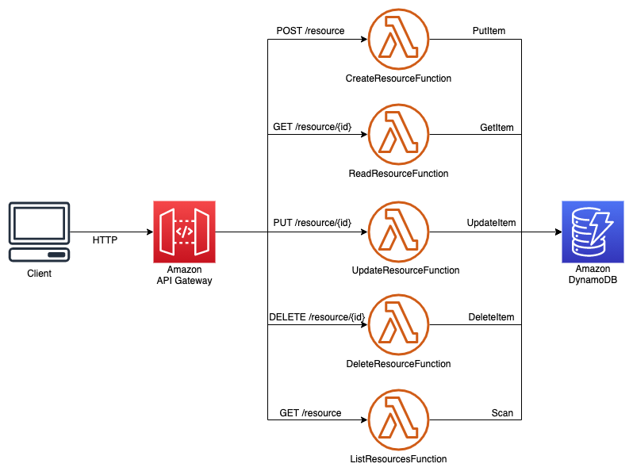

# java-crud-microservice-template

__Note__: this sample is used and described in the blog post: [TODO]()

This is a sample of serverless CRUDL (Create - Read - Update - Delete - List) microservice written in Java (JDK11). It demonstrates the use of AWS Lambda, AWS DynamoDB, Amazon API Gateway and AWS SAM (Serverless Application Model). 

But more important, it also demonstrates how to create a project template (or "archetype", not to be confused with an AWS SAM template file) that you can later use to bootstrap new projects based on this structure, using the AWS SAM CLI and the command `sam init --location`.

## Architecture
The architecture is the following and is pretty standard:



You can find the sources of this architecture and information about its deployment in the [sources](https://github.com/aws-samples/java-crud-microservice-template/tree/main/sources) folder.

This sample partially follows an [hexagonal architecture](https://aws.amazon.com/blogs/compute/developing-evolutionary-architecture-with-aws-lambda/): you will see that access to DynamoDB is done through an adapter, to avoid using the DynamoDB API directly in the Lambda handler, thus simplifying unit testing.

The sample also uses [aws-lambda-powertools-java](https://awslabs.github.io/aws-lambda-powertools-java/) to simplify logging, metrics and tracing. 

Finally, it also contains unit tests, leveraging the [aws-lambda-java-tests](https://github.com/aws/aws-lambda-java-libs/tree/master/aws-lambda-java-tests) library.

## SAM Project Bootstrap

The archetype, to be used by `sam init` is available in the [{{cookiecutter.project_name|lower|replace(' ','-')}}](https://github.com/aws-samples/java-crud-microservice-template/tree/main/%7B%7Bcookiecutter.project_name%7Clower%7Creplace('%20'%2C'-')%7D%7D) folder.

It uses [cookiecutter](https://cookiecutter.readthedocs.io/en/1.7.2/) (a template engine) to parameterize the project, thanks to variable defined between `{{` and `}}`. These variables can be used in folder names, file names and in the content of these files. Variables must also be declared in a [`cookiecutter.json`](https://github.com/aws-samples/java-crud-microservice-template/blob/main/cookiecutter.json) configuration file.

Once the project archetype is ready, you need to share it somewhere (git, mercurial, http endpoint). Then you can use the AWS SAM CLI to bootstrap your project specifying the location where your template is shared.

```bash
$ sam init --location git+ssh://git@github.com/aws-samples/java-crud-microservice-template.git
```

It will ask you to give values to the different variables:

```bash
project_name [Name of the project]: product-crud-microservice
object_model [Model to create / read / update / delete]: product
runtime [java11]: 
```

And it will generate the project, replacing all variables with the values you specified.

You can find the default SAM archetypes [here](https://github.com/aws/aws-sam-cli-app-templates) (for inspiration) and more information about `sam init` command [here](https://docs.aws.amazon.com/serverless-application-model/latest/developerguide/sam-cli-command-reference-sam-init.html)